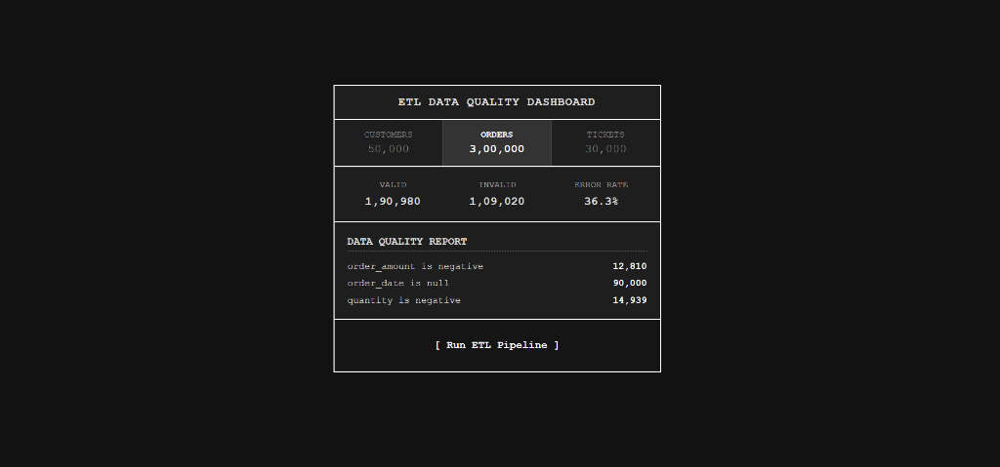
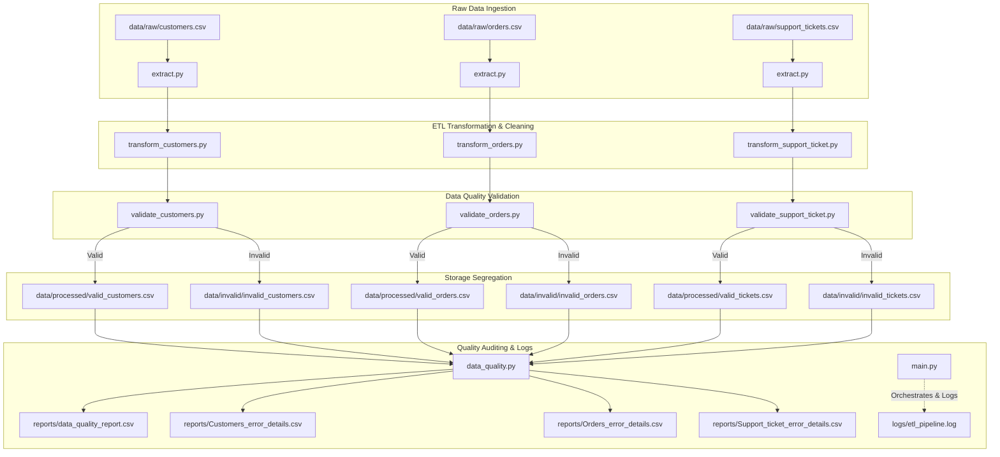

# ETL Data Quality Pipeline

A modular, robust, and fully-tested ETL (Extract, Transform, Load) data quality pipeline built with Python, Pandas, and FastAPI. The pipeline is designed to ingest raw business datasets, clean and transform them, validate them against strict business rules, segregate valid and invalid records, and generate comprehensive data quality reports.

---

## 📊 Interactive Quality Dashboard

The project features a lightweight, real-time web dashboard built with **FastAPI** to visualize data quality metrics and trigger pipeline executions on demand.



### Dashboard Features
- **Live Metric Tracking**: Shows the total records processed, valid count, invalid count, and real-time error rates for Customers, Orders, and Support Tickets.
- **Detailed Error Breakdown**: Lists specific validation rule violations and their frequency for the selected dataset.
- **Run Pipeline On-Demand**: Executes `main.py` directly from the UI and prints the console/file execution logs in a terminal-like view.
- **FastAPI Backend**: Serves static assets and provides JSON endpoints (`/api/metrics`, `/api/run-pipeline`) with high performance.

---

## 🏗️ Architecture & Data Flow

The project follows a standard modular ETL architecture, ensuring that each step of the pipeline (Extraction, Transformation, Validation, Reporting) is decoupled and independently testable.



### Module Structure

- **[extract/](extract/)**: Handles CSV ingestion with structured error logging.
- **[transform/](transform/)**: Standards format and type formatting (emails, phone numbers, datetimes, age computation).
- **[validate/](validate/)**: Flags record compliance against specific business logic and splits records into valid/invalid subsets.
- **[quality/](quality/)**: Computes overall stats (valid % per dataset) and details of failure frequency.
- **[data/](data/)**: Local database storage:
  - `raw/`: Unprocessed source CSVs.
  - `processed/`: Cleansed, validated source datasets.
  - `invalid/`: Corrupted/failing rows appended with a descriptive `validation_error` column.
- **[reports/](reports/)**: CSV summaries reporting overall data health and error category counts.
- **[logs/](logs/)**: Runtime logging of pipeline processes (`etl_pipeline.log`).

---

## 🔍 Validation Rules & Data Models

Each dataset undergoes strict row-level validations. Rows failing any constraint are moved to the `invalid` folder with all validation errors accumulated in a `validation_error` field.

### 👥 Customers

Located in [validate/validate_customers.py](validate/validate_customers.py):

*   **`customer_id`**: Must not be empty/null.
*   **`gender`**: Must be one of `M`, `F`, or `O`.
*   **`first_name` & `last_name`**: Must not be empty/null.
*   **`address`, `city`, `state`, `country`**: Must not be empty/null.
*   **`dob` & `signup_date`**: Must be valid, parseable datetimes.
*   **`age`**: Customer must be at least 18 years old (calculated dynamically as `(signup_date - dob).days / 365.25`).
*   **`email`**: Must match standard RFC 5322 email regex pattern.
*   **`phone_number`**: Non-numeric symbols are stripped; cleaned string length must be between 2 and 10 digits.
*   **`device_id(s)` & `source`**: Must not be empty/null.

### 📦 Orders

Located in [validate/validate_orders.py](validate/validate_orders.py):

*   **`order_id`**: Must not be empty/null.
*   **`customer_id`**: Must not be empty/null.
*   **`product_id`**: Must not be empty/null.
*   **`order_amount`**: Must be a non-negative number ($\ge 0$).
*   **`quantity`**: Must be a non-negative integer ($\ge 0$).
*   **`order_date`**: Must be a valid parseable datetime.
*   **`payment_method`**: Must not be empty/null.
*   **`status`**: Must not be empty/null.

### 🎫 Support Tickets

Located in [validate/validate_support_ticket.py](validate/validate_support_ticket.py):

*   **`ticket_id`**: Must not be empty/null.
*   **`customer_id`**: Must not be empty/null.
*   **`issue_type`**: Must not be empty/null.
*   **`ticket_created`**: Must be a valid datetime.
*   **`ticket_resolved`**: Must be a valid datetime and cannot be chronologically earlier than `ticket_created`.
*   **`support_agent`**: Must not be empty/null.
*   **`sentiment`**: Must not be empty/null.
*   **`resolution_time_hours`**: Must be non-negative ($\ge 0$).

---

## 🚀 How to Run

### 1. Install Dependencies
```bash
pip install -r requirements.txt
```

### 2. Run the ETL Pipeline
To execute the data quality pipeline and generate reports manually:
```bash
python main.py
```

### 3. Run the Dashboard
To start the FastAPI web dashboard locally:
```bash
python dashboard/app.py
```
After starting the server, open your browser and navigate to: **`http://127.0.0.1:5000`**

---

## 🧪 Testing & CI

### Run Tests Locally
The pipeline relies on `pytest` to verify validation rules and ensure that formatting behaviors are correct.
```bash
python -m pytest
```

- **[tests/customers_test.py](tests/customers_test.py)**: Validates customer email format rules, age constraints, and field nullability.
- **[tests/orders_test.py](tests/orders_test.py)**: Ensures orders validation catches negative amounts, quantities, and missing keys.
- **[tests/support_ticket_test.py](tests/support_ticket_test.py)**: Checks ticket validation logic for invalid dates, negative resolution times, and unresolved states.

### Continuous Integration (CI)
This project has a GitHub Actions CI pipeline configured to run automatically on any `push` or `pull_request`. 

The workflow is defined in **[.github/workflows/tests.yml](.github/workflows/tests.yml)** and performs the following steps:
1. Provisions an `ubuntu-latest` runner.
2. Injects Python `3.12`.
3. Installs package dependencies.
4. Runs the test suite via `pytest`.

[](https://github.com/Abhieeeh/ETL-data-quality-pipeline-/actions/workflows/tests.yml)